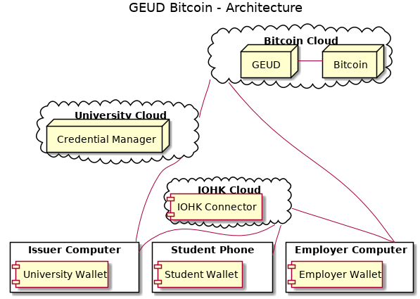
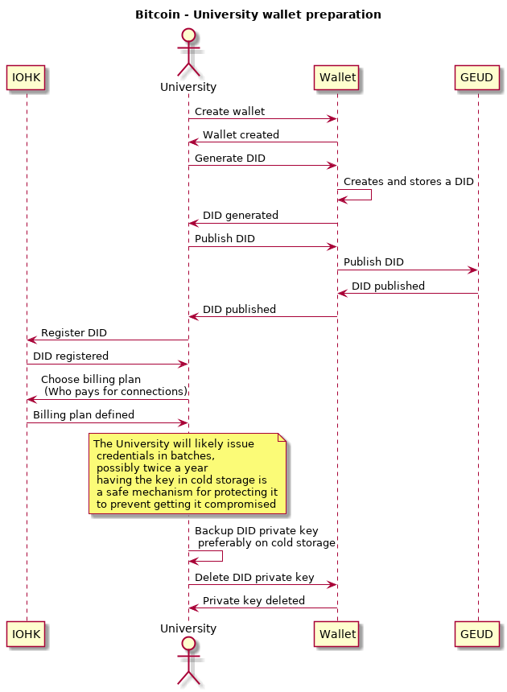
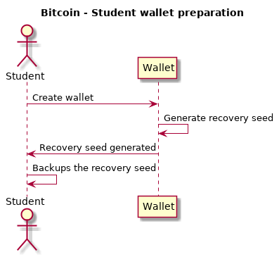
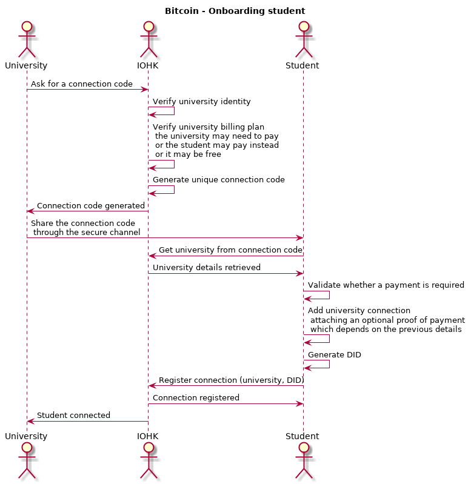
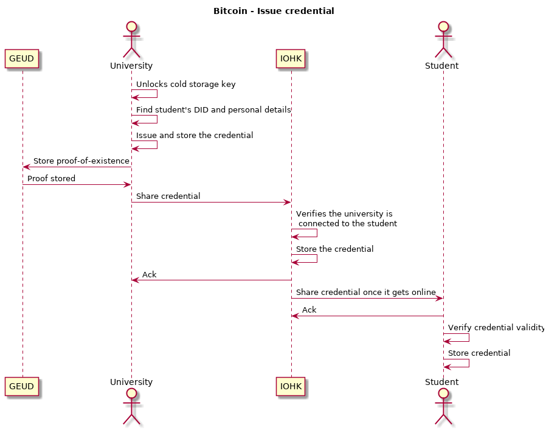
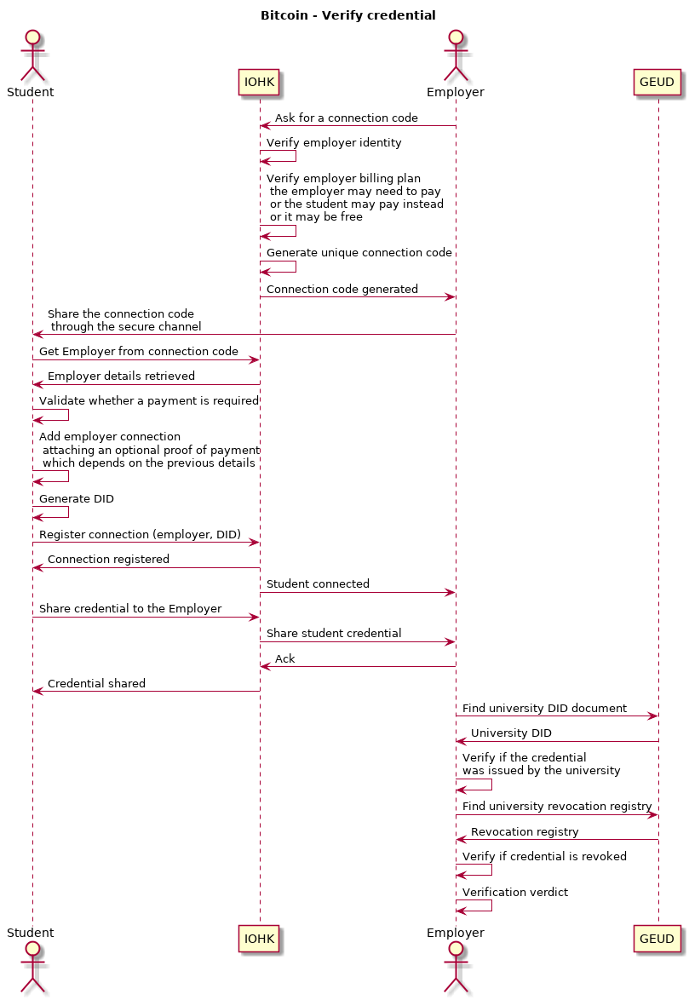
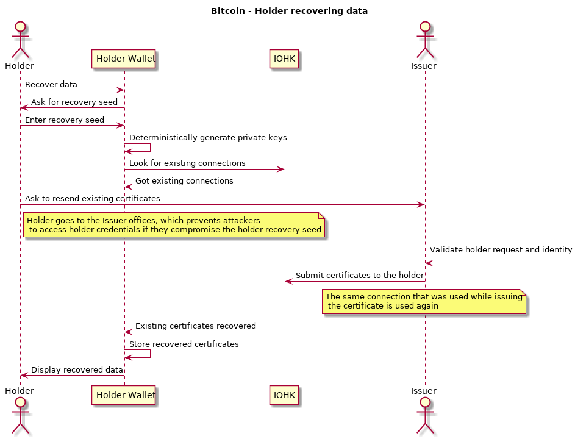

# Atala Prism - Bitcoin

This document has the high-level view of the Atala Prism project on top of Bitcoin.

Each participant will be responsible for managing and storing their secret keys securely, this includes issuers (like universities) and verifiers (employers).

Related to payments, the approach assumes we'll bill per connection, which indirectly correlates to issuing and verifying a credential, the drawback is that an issuer could issue several credentials to the same person but that shouldn't be a problem.

**NOTE [2019-09-02]**: We decided to follow this approach, so it is not a proposal anymore.

**NOTE [2020-11-03]**: You may also want to check some [newer](../new-diagrams/README.md) [diagrams](../misc/wmc/prism_architecture.png).

## Definitions
- **GEUD**: The Georgia University Degrees project.
- **Issuer**: The actor that is interested in issuing credentials to holders (like an university).
- **Holder**: The actor who receives and holds credentials (like a student).
- **Verifier**: The actor who is interested in verifying credentials from holders (like an employer).

- **Credential**: Formatted data holding some claims of certain holder, with cryptographic proofs from the issuer (like a university degree).

- **Issuer Computer**: The computer that the issuer uses to perform operations related to credentials, like issuing or revoking credentials.
- **Issuer Wallet**: A local application installed on the issuer computer which is in charge of storing securely the issuer private keys, as well as performing the cryptographic operations with those keys.
- **Issuer Web Application**: The web application that the issuer use to interact with the credentials.

- **Verifier Computer**: The computer that the verifier uses to verify credentials.
- **Verifier Wallet**: The local application installed on the verifier computer which stores the verifier private keys securely, as well as performing the cryptographic operations with those keys.
- **Verifier Web Application**: The web applications that allows the verifier to connect to credential holders as well as to validate those credentials.

- **Holder Phone**: The mobile phone used by the certificate holders to use the Holder Wallet.
- **Holder Wallet**: The mobile wallet (Android, iOS) used to store and share their credentials securely.

- **Frontend**: The server that can be reached from the internet, it's the entry point to the system.
- **Reverse Proxy**: A middleware that proxies HTTP connections from clients to the internal servers.
- **Web Application**: An application downloaded from the frontend that runs locally on the computers.

- **IOHK Cloud**: The IOHK infrastructure which runs all the services and servers, controller by IOHk.
- **Node**: The component that acts as a 2nd layer node on top of a ledger.
- **ATALA Node**: The 2nd layer node working on top of Bitcoin. It understands DIDs and credentials, any interested party can run this node to get the Prism blockchain details, but is not a requirement, the data will be safe even with a single node running.
- **ATALA Database**: The centralized database used by the ATALA Node to index information.
- **Bitcoin**: A full Bitcoin node that keeps the blockchain available to let us retrieve the ATALA-specific transactions.

- **Connector**: As there are mobile phones involved, the task of communicating with them starts to get complicated, this component solves that problem, it allows to open bidirectional communication channels from the issuers/verifiers to the holders wallet, the connector also servers as a mailbox to deliver messages to the holder wallet once it gets online.
- **Connector Server**: The server providing the connector API.
- **Connector Database**: The database used by the connector server.

- **Credentials Manager**: The university will need a way to store historical records, like all the issued credentials, this service is the one allowing the university to perform CRUD operations on such records.
- **Credentials Manager Server**: The server providing the credentials manager API.
- **Credentials Manager Database**: The database used by the credentials manager server.

## General overview
This diagram shows all the components:

**NOTE**: At Nov/29 the Credentials Manager has been merged into the Connector, the [PR](https://github.com/input-output-hk/atala/pull/477) has more details.

### Preparation steps

As IOHK will run all the infrastructure for providing the credentials verification product and services, IOHK needs a way to onboard the issuers into the system.

**IOHK holds the relationships between issuers and their public DID, onboarding an issuer means that IOHK adds a new relationship**.

The issuer needs to do some preparation steps before being able to issue credentials:

The holder also needs to do some preparation steps before being able to receive credentials, please note that these steps may be done on the onboarding process:

Completing the preparation steps means that:
- The issuer has everything ready to issue credentials.
- IOHK knows about the issuer and can allow it to connect to holders, this also implies that the issuer has registered a payment method with IOHK.
- The issuer has its private key stored securely (ideally, in cold storage).
- The holder has already created a wallet.

### Onboarding the holder
The onboarding process involves getting the issuer and the holder connected on the system, which will allow them to exchange messages.

For this process to work, the issuer must have a secure way to share a QR code with the holder.

### Issuing a credential
The issuer will likely get the issuing private key unlocked from cold storage, issue a batch of credentials, and move the private key back to the cold storage. IOHK will serve as a mailbox to store the encrypted credential for each holder, and share them with the holders once their wallets them get connected to the internet.

### Verifying a credential
A verifier will need to verify a credential from a holder.

In order to validate the credential, it needs to be shared to the verifier, the holder and the verifier can follow a similar onboarding process in order to get them connected, then, the holder shares the credential with the verifier by using that connection.

The verifier interacts with the node in order to verify the credential validity.

**NOTE**: Exporting the credential is not supported on purpose, that forces the holder to go to our connection channels which is the only way we could charge for certain operations, the issuer should be able to export credentials.

### Holder recovering data
As the holder's wallet generates a recovery seed when creating it, the same recovery seed could be used after installing the mobile app on a different phone to recover its data. The recovery seed only allows to recover the private DIDs, the certificates need to be sent again from the issuer, which can be done by reusing the connection that was used to issue the certificates.

The manual process for recovering the certificates prevent unintended access to people that got access to the holder's recovery seed.

**NOTE**: For a future version, we may want to support recovering the holder's data automatically, which can be restored if we kept encrypted backups on the cloud but we need to take into consideration that compromising the recovery seed could compromise all the holder's data.
