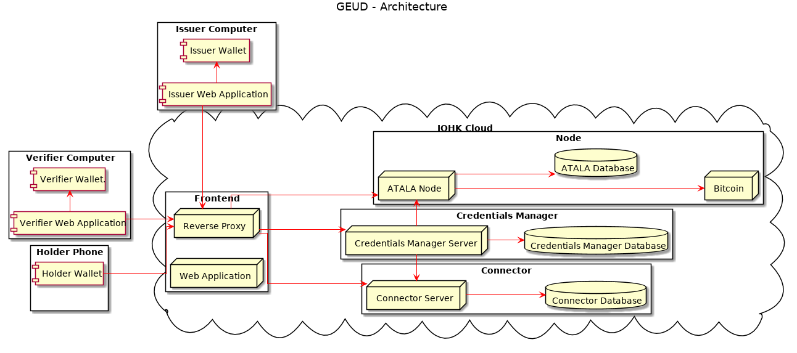
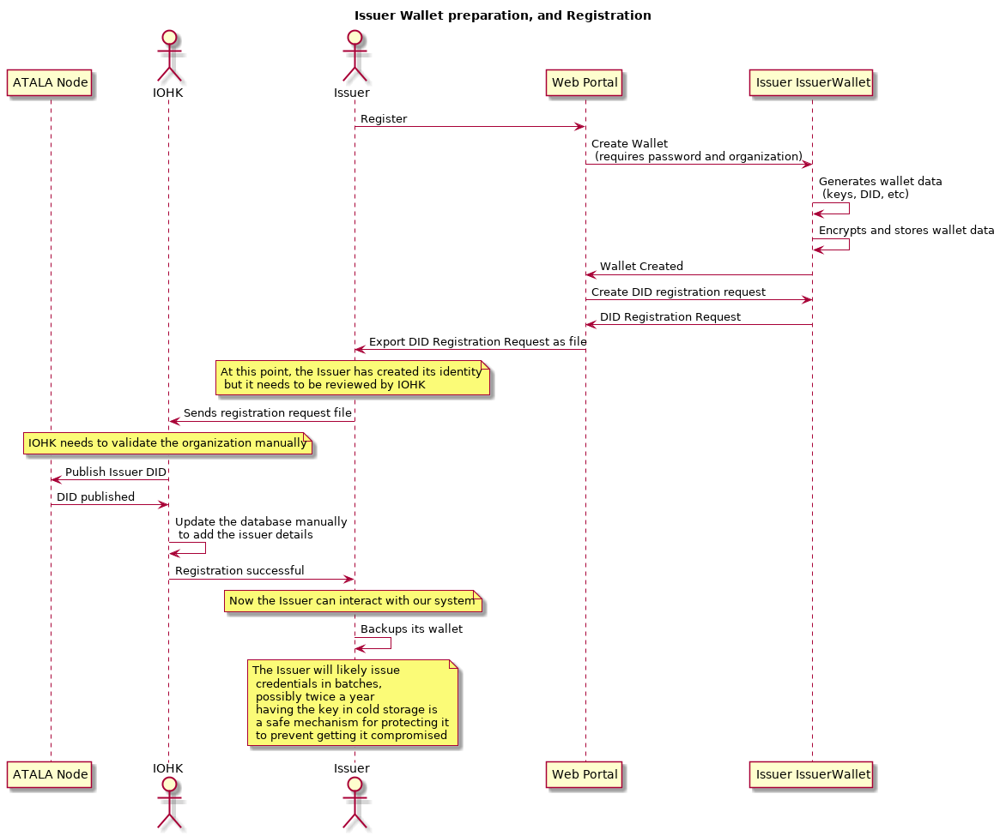
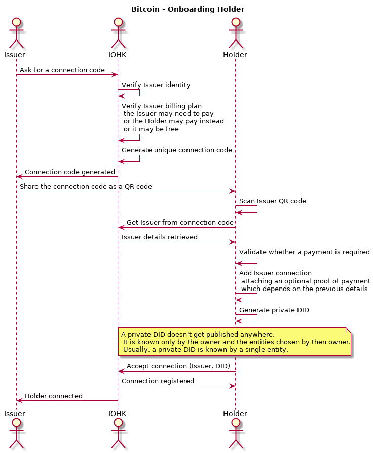
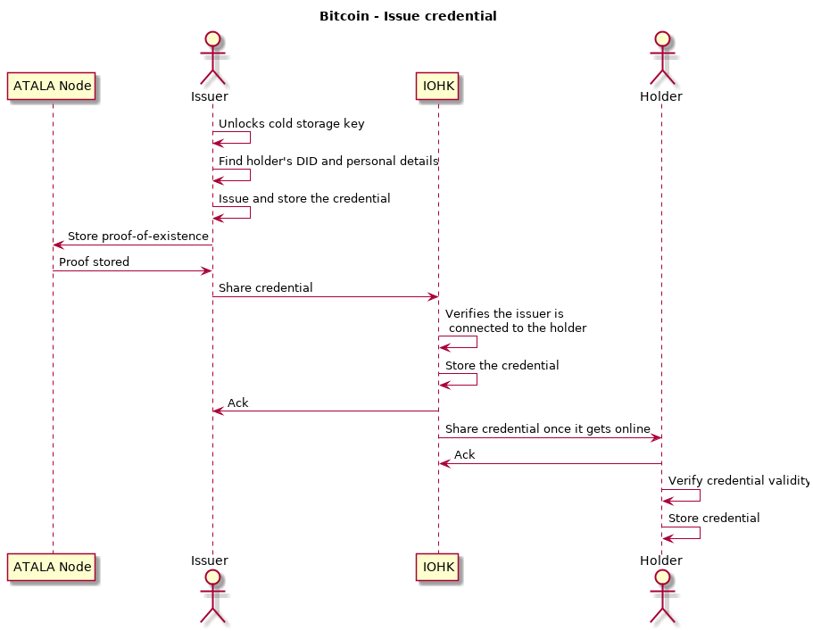
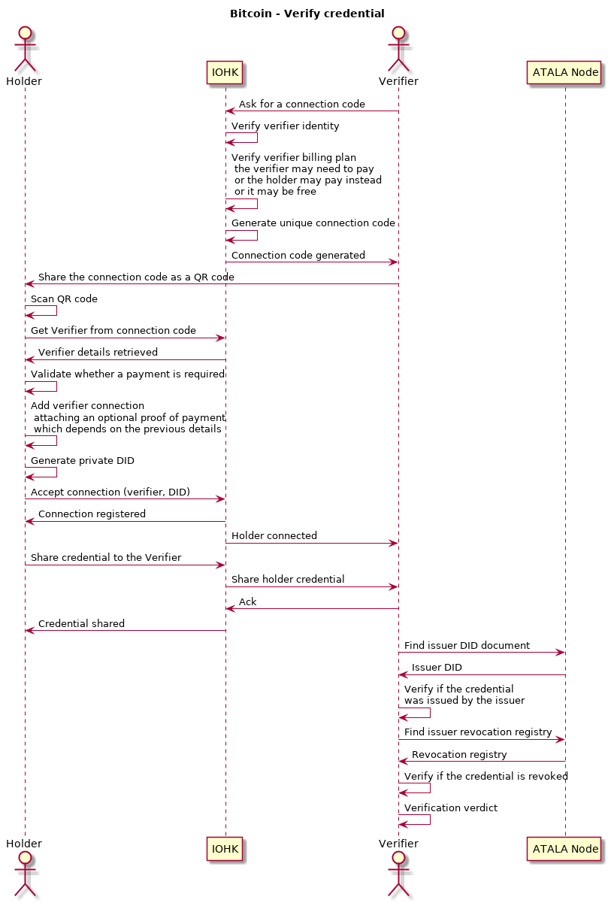

# GEUD Proposal - Bitcoin

This document has a proposal for building the GEUD project on top of Bitcoin.

Everything on this document is related to how the GEUD project will look like if implemented using Bitcoin.

Each participant will be responsible for managing and storing their secret keys securely, this includes issuers (like universities) and verifiers (employers).

Related to payments, the approach assumes we'll bill per connection, which indirectly correlates to issuing and verifying a credential, the drawback is that an issuer could issue several credentials to the same person but that shouldn't be a problem.

**NOTE**: As of 02/Sep/2019, we decided to follow this approach.

## Key differences from Indy design
There are some key differences from the Indy design and the Bitcoin design:
- Bitcoin stores the university revocation registry which means that the university doesn't need to be queried for validating credentials.
- The employer connects directly to GEUD for verifying a credential, which means that a credential can be verified for free.
- There is no need for IOHK Agents that accept credential offers on behalf of the student, this is a limitation from Indy, in Bitcoin, we have the whole control and can remove this limitation.

## General overview
This diagram shows a general overview on how the ideal system would work, we could get there incrementally:

## Architecture with Bitcoin

This is an architectural view on the components and how they interact.

### Components
The components are distributed among different entities which run the server side projects, and some of them run on a device owned by a person, like a mobile wallet.

Note that there are pieces omitted on purpose, like the databases, there is a separate design document for each service.

#### IOHK Cloud
Represents the services that IOHK is running to support the project functionality.

##### Connector
As there are mobile phones involved, the task of communicating with them starts to get complicated, this component solves that problem, it allows to open bidirectional communication channels from the universities/employers to the students wallet, the connector also servers as a mailbox to deliver messages to the student wallet once it gets online.

#### University Cloud
Represents the services that are running on the university servers/cloud, these services are the ones involved on storing information private to the university.

##### Credentials Manager
The university will need a way to store historical records, like all the issued credentials, this service is the one allowing the university to perform CRUD operations on such records.

#### Ledger services
While Bitcoin is used for its public ledger, the information related to the GEUD project is not something that the Bitcoin network understands, for that reason, a wrapper will be created (GEUD Node), this wrapper will keep monitoring the Bitcoin network to detect transactions related to the GEUD network.

##### Bitcoin node
A full Bitcoin node that keeps the blockchain available to let us retrieve the GEUD-specific transactions.

##### GEUD Node
This is just a node on top of Bitcoin which understands DIDs and credentials, any interesting party can run this node to get the GEUD blockchain details, but is not a requirement, the data will be safe even with a single node running.

#### Devices
The devices are run by a single or multiple users depending on the required usage.

- Student phone: Runs the Holder Wallet which holds the student's private data, like the credentials received.
- Issuer Computer: Runs a special wallet for the university which allows to issue credentials, it also access the University Credentials Manager to query historic information (this special wallet could be part of the Credential Manager, TBD).
- Employer Computer: Runs a special wallet that allows to receive credentials from the student, as well as to verify their validity.

### Preparation steps

The university needs to do some preparation steps before being able to issue credentials:

The student also needs to do some preparation steps before being able to receive credentials, please note that these steps may be done on the onboarding process:

Completing the preparation steps means that:
- The university has everything ready to issue credentials.
- IOHK knows about the university and can allow it to connect with students, this also implies that the university has registered a payment method with IOHK.
- The university has their private key in cold storage.
- The student has already created a wallet.

### Onboarding student
The onboarding process involves getting the university and the student connected on the system, which will allow them to exchange messages.

For this process to work, the university must have a secure way to share a secret with their students, some options could be:
- A piece of paper given personally to the student.
- An email to the student.

**NOTE**: The student DID is unique per connection.

### Issuing a credential
The university will likely get the issuing private key unlocked from cold storage, issue a batch of credentials, and move the private key back to the cold storage. IOHK will serve as a mailbox to store the encrypted credential for each student to shared them with the student wallets once they get online.

### Verifying a credential
A potential employer may want to verify a credential from a student (Which is unlikely to be a student anymore but that's the current used term).

In order to validate the credential, it needs to be shared to the potential employer, the student and the employer can follow a similar onboarding process in order to get them connected, then, the student shares the credential with the employer by using that connection.

The employer interacts with the ledger in order to verify the credential validity.

**NOTE**: Exporting the credential is not supported on purpose, that forces the user to go to our connection channels which is the only way we could charge for certain operations.
**NOTE**: There may be more steps involved on the credential verification.
