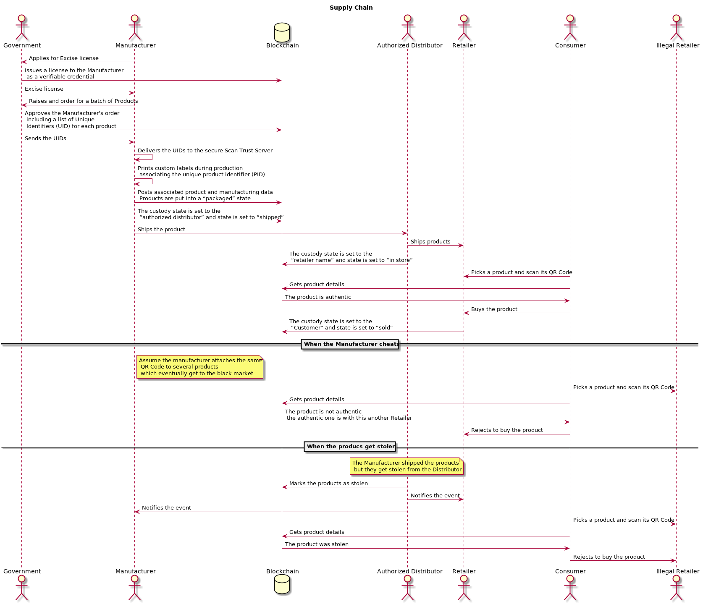
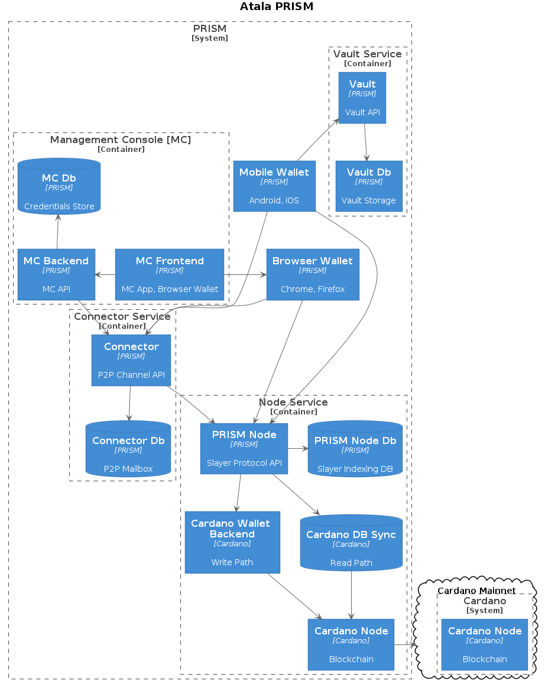

# Miscallaneous diagrams

Miscallaneous diagrams used on several occasions, e.g. in presentations.

## Supply chain diagram for Deloitte

## PRISM architecture

This was used in a presentation to [World Mobile Chain](https://www.worldmobile.io/the-chain/) on 2020-10-29. We basically use PlantUML and its [built-in](https://plantuml.com/stdlib) support for [C4](https://c4model.com/). For more details, check [ATA-3489](https://jira.iohk.io/browse/ATA-3489).

