# New diagrams

This folder includes the architecture/sequence diagrams updated at August/2020.

## New group flow

Describes the proposal to let organizations import their data into our system:
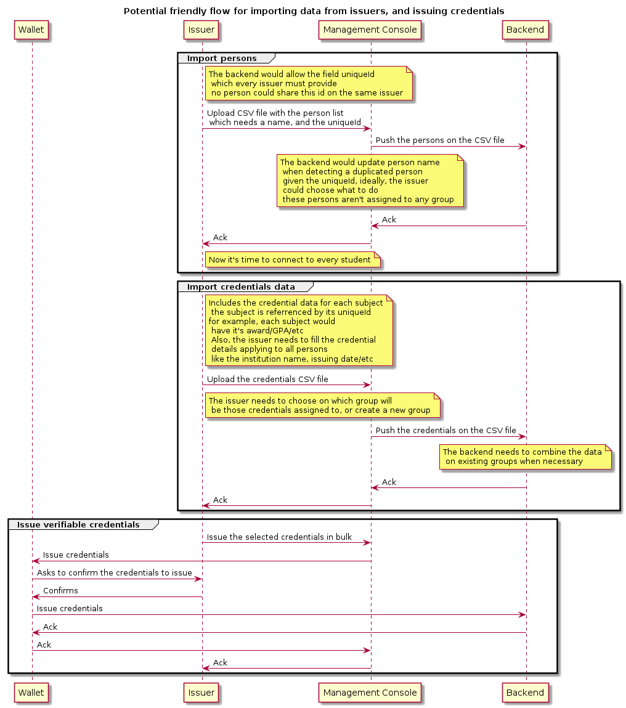

## New flow description for the commercial team

### Current architecture
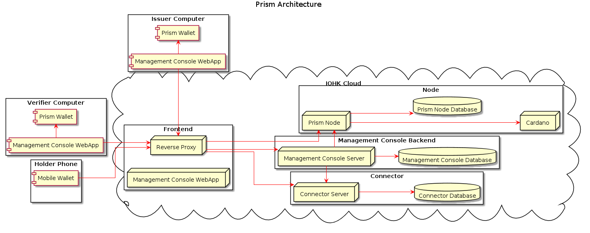

### Issuer registration
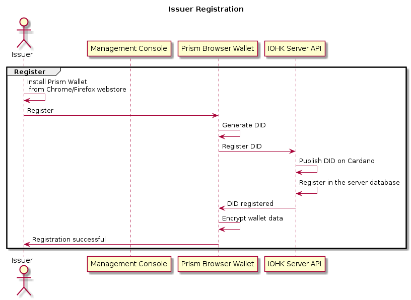

### Login
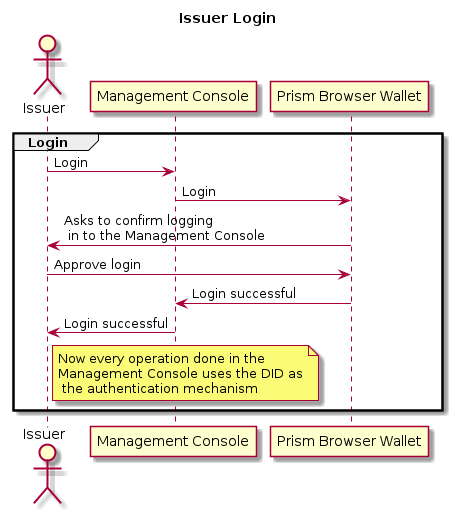

### Onboarding contacts
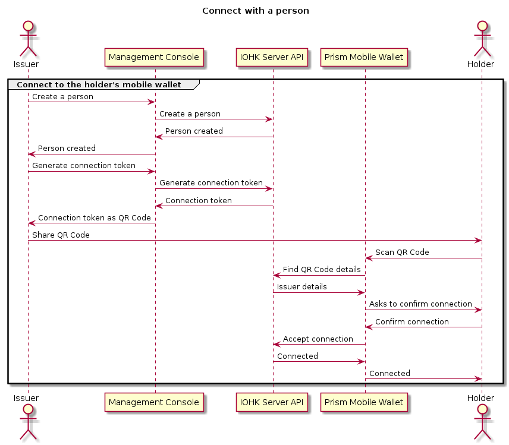

### Create credential group
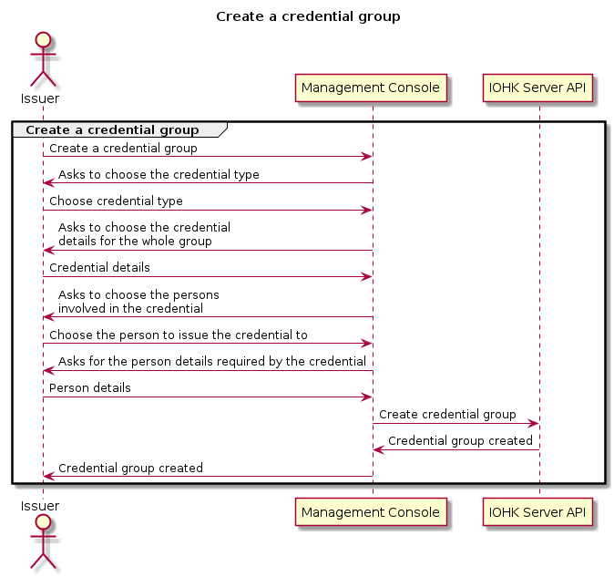

### Issue credential
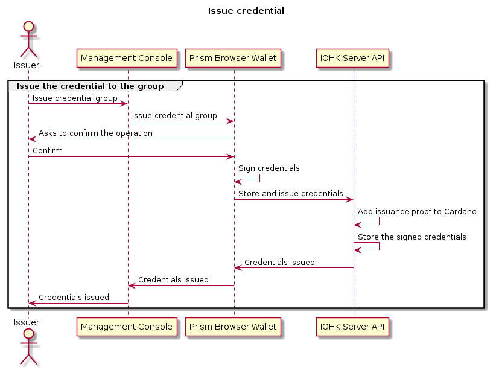

### Share credential
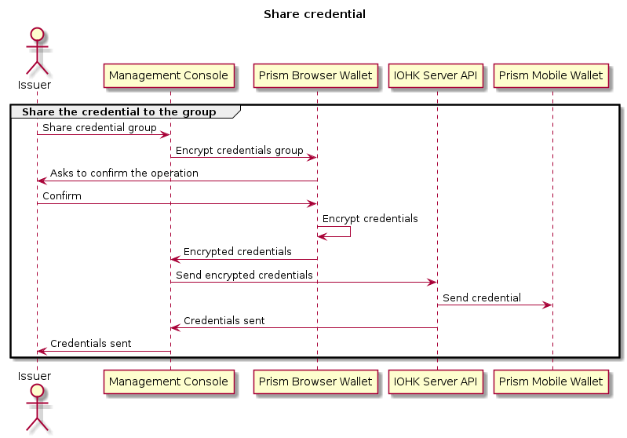

### Share credential to be verified
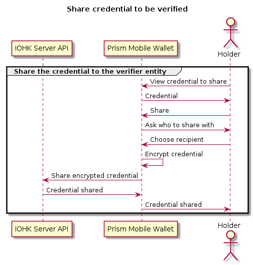

### Verify credential steps
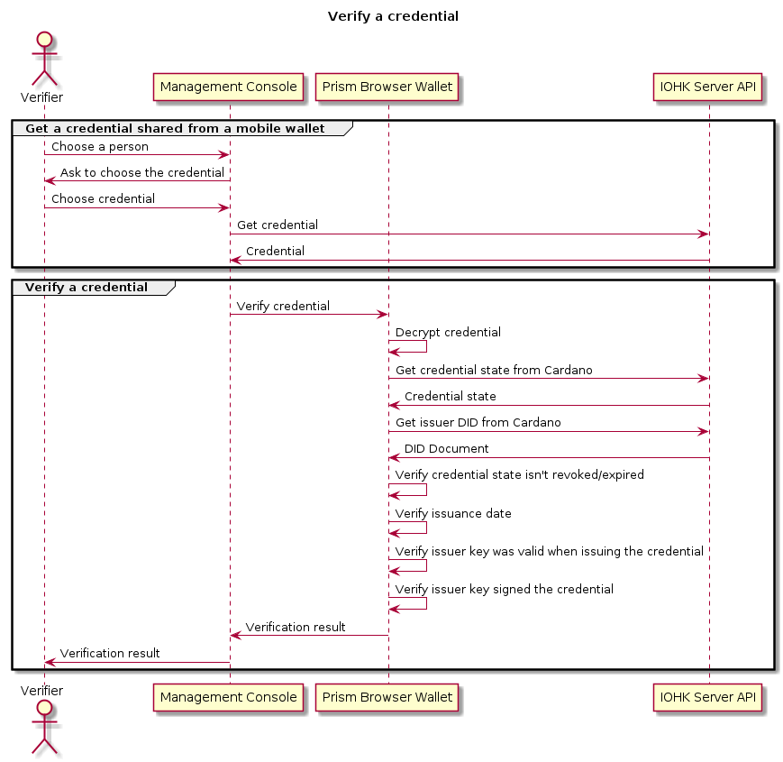

### Revoke credential
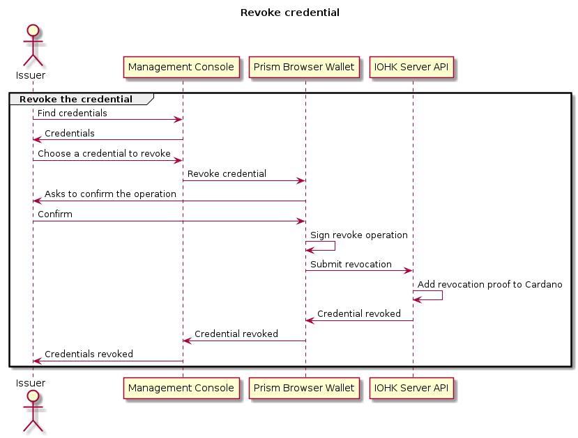
