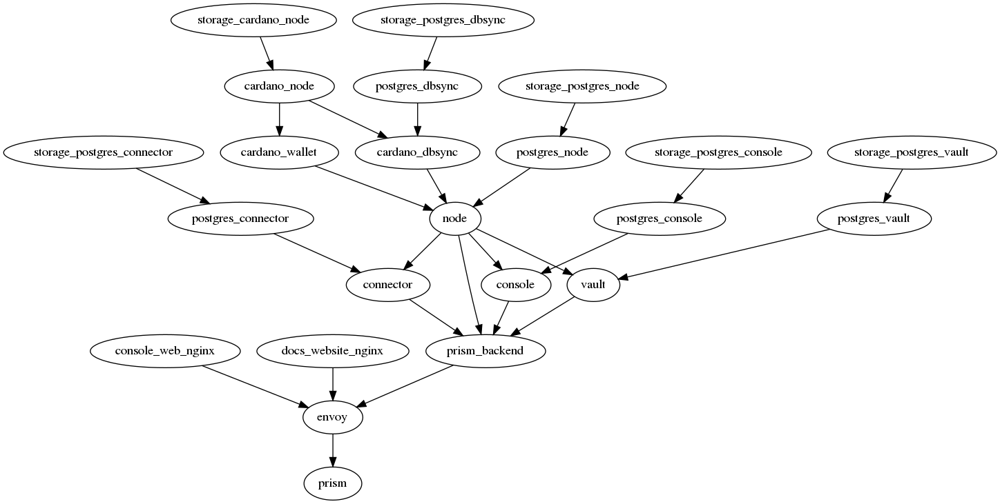
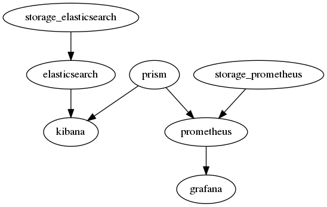
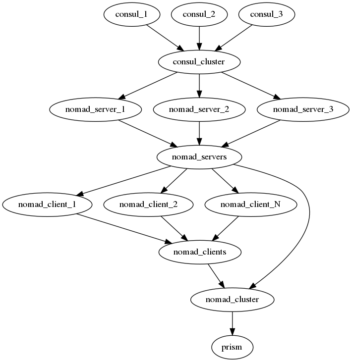

# Atala PRISM on-premise deployments
While PRISM has terraform scripts to create new environments smoothly, those have locked us into AWS, preventing us to easily deploy PRISM to other environments, like custom virtual machines or custom servers, for example, the MoE deployment won't use AWS but their own servers.

The goal for this document is to analyze what's required to deploy PRISM to on-premise instances by not depending on specific cloud providers (like AWS), the integration will be successful when we can deploy PRISM to AWS EC2 instances, Digital Ocean droplets, any other cloud supporting VMs, and even our local environment. All of this with as few manual steps as possible.

Let's put these steps as the ideal scenario for on-premise deployments, while these could be automated in popular cloud providers, these are likely the minimum ones required:
1. Create the VMs, grabbing the IP addresses to the cluster config (let's assume we have ssh-access to those VMs after creation).
2. Get the necessary domains and set up the DNS, updating the relevant cluster config.
3. Get the relevant TLS certificates and set those to the cluster config.
4. Run an ansible playbook that will set everything up.

Of course, this is an ideal scenario, and it is very likely that other manual steps will be required, like setting up special config in the actual physical machines (networking stuff), setting up a private container registry used for deployments, authentication related stuff, etc.

**TO BE CONFIRMED**: One tricky detail for MoE is that they can cut the internet traffic to anything outside of Ethiopia which will prevent us from using any public service, for example, we need to use a self-hosted container registry, otherwise, deployments won't work when there is no internet connection.

## Container orchestration
When talking about on-premise instances, it is natural to think about container orchestration solutions like Kubernetes (K8s).

Container orchestration tools aim to automate common workflows while dealing with deployments, like load balancing, self-healing services, service discovery, blue-green/canary deployments, and more.

For example, we could define that 3 instances from PRISM connector are required, by using a container-orchestration tool, we'll be sure that there are 3 healthy instances running, if any instance fails, a new instance will be created automatically.

While K8s is the most popular container orchestration tool, it is well known that it is a heavy tool, requiring considerable maintenance, like a specific team focused just in K8s.

The proposal is to **NOT** use K8s but [Nomad](https://www.nomadproject.io), this [comparison](https://www.nomadproject.io/docs/nomad-vs-kubernetes/alternative) is very appealing for a small team like ours, besides that, these are the main reasons to consider Nomad:
1. Simplicity in usage and maintainability
2. IOHK DevOps team already uses Nomad which can be helpful to get internal support.
3. Containers are just one way to run apps, Nomad supports running jar files too. Due to the MoE internet cut-off, we need to run our own container registry, if that option fails or turns out to be too complex, we can always fallback to run jar files instead.

### Nomad integration
In order to integrate Nomad, there are some details to be aware of:
1. [Deployment system requirements](https://learn.hashicorp.com/tutorials/nomad/production-reference-architecture-vm-with-consul?in=nomad/production#system-reqs)
2. A cluster is composed from nomad servers and nomad clients.
3. There are 3 or 5 nomad servers recommended for the cluster, these are used to manage the cluster state. RAFT is used as the consensus algorithm.
4. There is no restriction in the number of clients, these are used to deploy the applications.
5. Every instance participating in the cluster needs to run the nomad app (either as a server or client mode).
5. Every instance participating as a nomad client needs to have the necessary [drivers](https://www.nomadproject.io/docs/drivers) installed, in our case, it would be mainly [docker](https://www.nomadproject.io/docs/drivers/docker).

Given the instance pre-requisites, it is natural to think on configuration provisioning tools like [ansible](https://www.ansible.com/), so that there is an automated workflow to get the nomad clients/servers ready.

By leveraging ansible, we could get a simple flow to bootstrap a nomad cluster, like:
1. Get the IP addresses for the instances that will host the nomad cluster (assume that you have ssh access to those).
2. Create the necessary ansible hosts file by setting up the IP addresses related to nomad clients and the nomad servers.
3. Run the ansible playbooks to configure the nomad cluster.

It is worth adding that this approach works for on-premise instances as well as any popular cloud.

At last, these are some useful details to know:
1. Nomad exposes a nice [web UI](https://learn.hashicorp.com/collections/nomad/web-ui) which is unlikely to be exposed directly to the internet, a reverse proxy like nginx could be required.
2. Operating the Nomad cluster requires access to its RPC API, an SSH tunnel could be required.

## PRISM <> Nomad

The internal IOHK's DevOps team listed the following tools as their current stack, we'll try to be similar to it ([source from Slack](https://input-output-rnd.slack.com/archives/CH4MQJAN8/p1620355932325200?thread_ts=1620327748.316900&cid=CH4MQJAN8)):
- Ingress using traefik
- Storage using glusterfs
- Monitoring/logging using Victoria metrics
- Job scheduling using nomad
- Secret storage using vault
- Service discovery using consul
- Nomad to run the jobs themselves
- Cue to define the jobs without having to understand nix
- Terraform for infrastructure
- Oauth2 for SSO auth to service frontends (such as monitoring)

Deploying PRISM to on-premise instances is far from trivial, just look at these deployment dependency graphs which specify each server dependencies (Mirror/intdemo left out on purpose because MoE doesn't require those):
- Nodes with no dependencies are the first to be deployed.
- Nodes with dependencies can be deployed only after its dependencies.
- A dependency like `a -> b` means that `a` must be deployed before `b`.
- A topological order can allow us to deploy services in parallel and in the right order.

### PRISM deployment

### Monitoring deployment

### Nomad deployment
We'll require to deploy Consul, Nomad servers and Nomad clients, while the number of instances per cluster will be different that what's in the diagram, this should get you a better idea on what's required.

### Extra stuff
There are some extra details to be aware of:
- As pointed out previously, nomad UI likely needs a reverse proxy to be reachable from the internet (possibly envoy)
- There is considerable network configuration required to get the cluster working properly.
- Configuring the disk storage for a production deployment is far from trivial.
- We'll likely need Consul/Vault integrated (not specified in the diagrams).
- Envoy is likely going to be the way to communicate with PRISM from the public internet, where Consul will provide the discovery mechanism to reach out to the internal services (not specified in the diagrams).
- A custom container registry is necessary before being able to do MoE deployments.

### The plan
The plan to get the Nomad integration working consists of several iterations:

1. Get a Nomad cluster deployed manually to understand how to do it.
2. Create ansible scripts to automate as much as possible from the Nomad cluster deployment.
3. Create the Nomad jobs to get a minimal Node version deployed, this version won't launch Cardano by either using the instance we already have, or by using the in-memory ledger, avoid envoy or reverse proxies if possible.
4. Get the PRISM minimal version deployed by Nomad, done by running the jobs manually, this involves Connector, Management Console, Vault, and Node (from the previous step).
5. Get envoy deployed so that grpcweb can be used with the new environment.
6. Start picking logs to the monitoring services we have set up.
7. Evaluate the security model and do any necessary/critical improvements, TLS certificates, ACL for accessing Nomad's UI, use private networks for the cluster, open the minimal necessary ports in the instances, etc.
8. Evaluate and compare the new approach to the existing terraform-based deployment, possibly make a plan to improve the existing approach.
9. Assuming that Nomad plays a nice role in our internal deployments, set it up by leveraging CircleCi, it is likely that it will be a mix between Ansible/Terraform.
10. Try to do a deployment similar to what should be done in MoE which should allow us finding missing details.
11. Consider integrating auto-scalling policies.
12. Evaluate how we can improve everything with Consul.
13. Evaluate how to improve secret-management with Vault.

## Resources
- [HashiCorp Nomad on AWS](https://aws.amazon.com/quickstart/architecture/nomad/)
- [Why you should take a look at Nomad before jumping on Kubernetes](https://atodorov.me/2021/02/27/why-you-should-take-a-look-at-nomad-before-jumping-on-kubernetes/)
- [Nomad docs](https://www.nomadproject.io/docs)
- [Consul <> Envoy Integration](https://www.consul.io/docs/connect/proxies/envoy)
