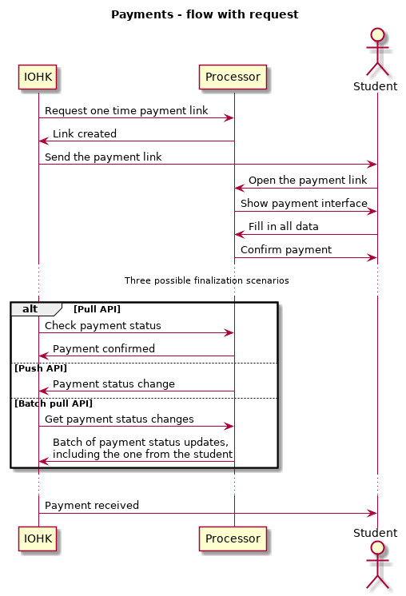
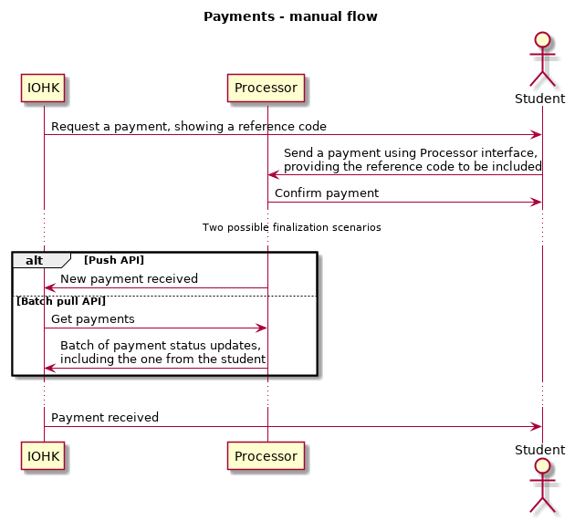

## Payment flow

Receiving payments is an important part of the credential project, as it is the way to provide us with revenue. We want to cooperate with a Payment Processor - third party that handles transactions by credit cards, debit cards, and possibly other kinds of payments such as bank transfers or cryptocoins. This document aims to list the requirements that should be met in order to let us integrate with it.

This document focuses on the case where it is the student making the payment, but it is without loss of generality as all flows can be applied to the issuer or the verifier as well.

### Synchronous vs asynchronous payments

There are two possible ways of realizing payments: one as a part of UI flow, not letting them progress further until they finish it, the other listing pending payments and starting new flow, when the payment is confirmed.

In case of asynchronous payments it is fine with us if the payment confirmation takes some time, e.g. it arrives the next day. For synchronous payments it is crucial to have a payment processor that is able to confirm payment quick, e.g. in 30 seconds.

Synchronous payments are utilized in current design, so it is required to have Payment Processor support.

### Payment request flow

Flow starts with directing student to the payment interface using generated payment link. Student then interacts with the Payment Processor, using their interface to make the payment.

After that we need to receive status update, there are three possibilities:

* by querying the interface, possibly repeatedly,
* by exposing an endpoint (REST one probably) where the Payment Processor can push notifications,
* by querying batches of payment status updates; that is the least convenient options, as we probably wouldn't like to make such queries for each payment, so we would have single stream of updates and dispatch it to payments.

### Manual payment flow

This is obviously inferior payment flow as it forces the student to manually type payment data, but it is an option. It starts with us showing the student reference code in the UI. They have to initiate the payment themselves, providing the reference code so we can later correlate the payment with our records. Payment is finalized in one of two ways, similar to these in payment request flow.

## Requirements

### Payment link generation

IOHK can request Payment Processor to generate an one time payment link that can be opened by the student in order to pay us. Student should not have to fill in payment receiver details, it should be already set up for him.

Other concepts that are extensions of this functionality are:
* IFrame components: ability to generate an IFrame to be used in the UI,
* In case of mobile phones if Payment Processor has their own app, the equivalent is to generate iOS application launch URL or Android Intent data. App should open with IOHK as a payment receiver and amount pre-filled. Another option is Payment Processor providing SDK to be included in our application.

__Importance: Very High__ for UI links, __Medium__ for mobile apps. It is required for intuitive payments.

### Reference data in payment

Student can include reference data in the payment, so we can use it to correlate the payment with what it pays for. It is required if it is the student who initiates the payment. In case of using payment links, payment link id can be used for referencing, as long as it is unique.

__Importance: Very High__, required for automatic correlation of payment request and payments.

### Getting status of single payment

IOHK can query Payment Processor, providing payment id, receiving current payment status.

__Importance: Very High__, best way to verify payment result.

### Payment status change notification

IOHK can configure an endpoint (e.g. REST endpoint) to be notified by Payment Processor about all status changes.

__Importance: Medium__, might speed up payment detection, but that is not a big concern.

### Listing status changes of payments

IOHK can query Payment Processor for status changes. 

__Importance: Medium__, ability to bulk load status updates might be useful for being able to provide full payment history.

### Fast confirmation

Payment processor is able to confirm payments quick enough for including it as a part of UI flow, below a minute.

__Importance: High__, in order to provide fluid User Interface on our side.

### Storing credit card numbers

Credit Card details entered once should be stored on Payment Processor system (PCI compliant) to make further payments easier.

__Importance: High__, as it is in product requirements.

### Verifiable payment proofs

Payment processor provides student a downloadable payment proof.

__Importance: Low__, might be useful in disuptes.

### Refunds
Payment processor provides a method to refund the student that paid for something we found we or the University is not able to provide - e.g. they have been given connection token, but after verification found that they have failed their exam.

__Importance: Medium__: because of specifics of credentials refunds should be very rare and could be handled manually.
