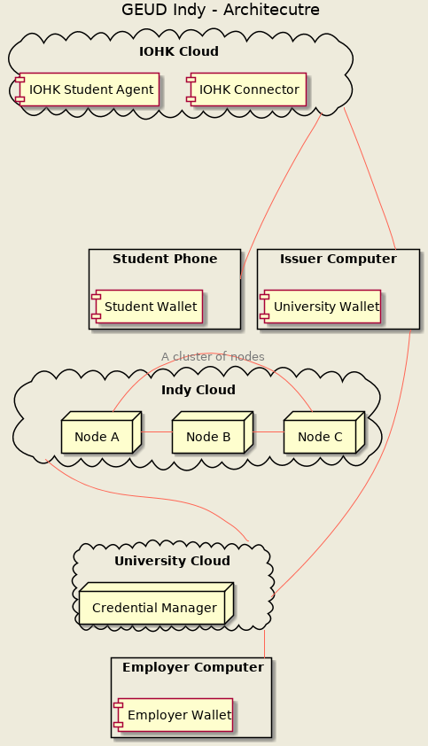
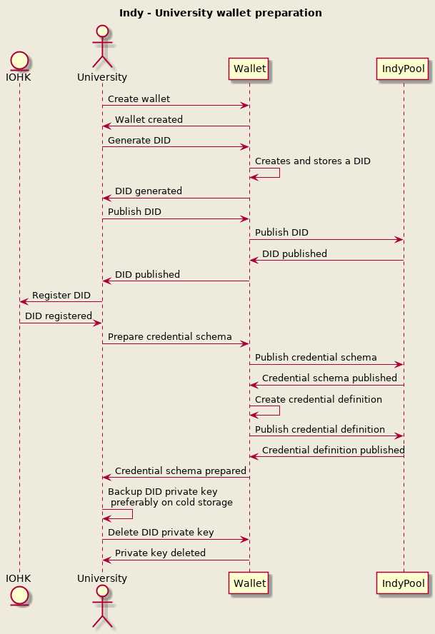
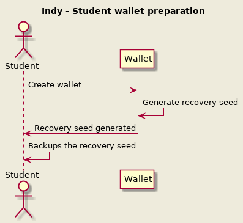
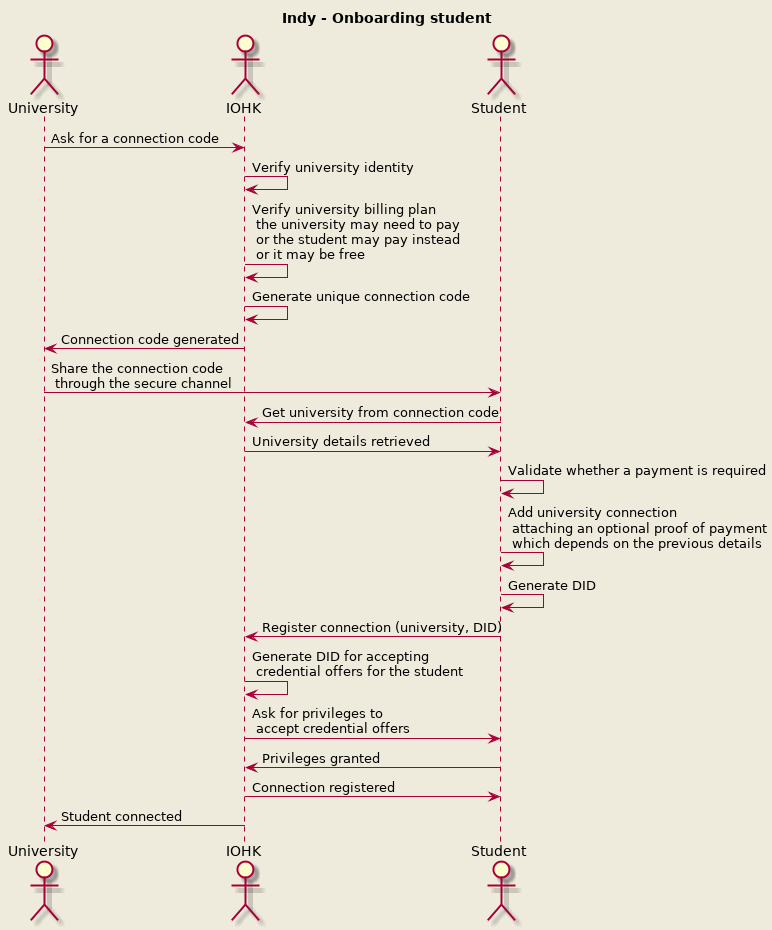
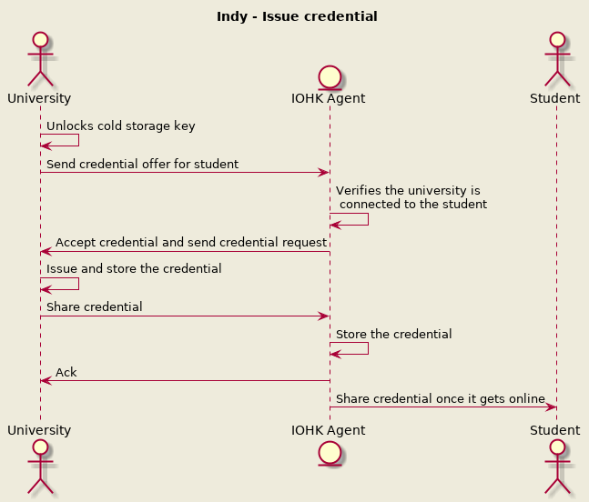
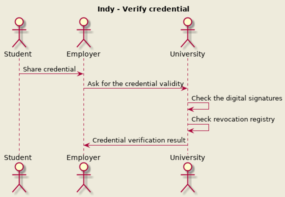

# GEUD Proposal - Indy

This document has a proposal for building the GEUD project on top of Indy.

**NOTE**: Everything on this document is related to how the GEUD project will look like if implemented using Indy, there are some processes that are required to comply with their requirements.

**NOTE**: As of 02/Sep/2019, it was decided to go with Bitcoin, and this document is kept as a reference while the content is likely outdated, one key details is that the document assumes that we will bill for verifying a credential, and no one can access the ledger directly but the universities.

## Architecture with Indy

This is an architectural view on the components and how they interact.

### Components
The components are distributed among different entities which run the server side projects, and some of them run on a device owned by a person, like a mobile wallet.

Note that there are pieces omitted on purpose, like the databases, there is a separate design document for each service.

#### IOHK Cloud
Represents the services that IOHK is running to support the project functionality.

##### Connector
As there are mobile phones involved, the task of communicating with them starts to get complicated, this component solves that problem, it allows to open bidirectional communication channels from the universities/employers to the students wallet.

##### Cloud Agent
Another issue with mobile phones is that they aren't always online, there are some operations which may require them online, one example is that in order for the student's wallet to receive a credential, it first needs to accept it, the cloud agent is perfect to just accept them even when wallet is offline.

The Cloud Agent can also serve as a mailbox for storing incoming messages from its connections, as well as possibly storing a encrypted backup of their data (if they are willing to do so).

**NOTE**: This component is only required to get integrated with Indy.
**NOTE**: Another approach to evaluate is to remove the need for an agent by issuing the credential offers each time there are credentials issued, which would lead to a single an extra access to the issuer's key on the first time only.
 

#### University Cloud
Represents the services that are running on the university servers/cloud, these services are the ones involved on storing information private to the university.

##### Credentials Manager
The university will need a way to store historical records, like all the issued credentials, this service is the one allowing the university to perform CRUD operations on such records.

#### Indy Cloud
This is just a set of Indy nodes, which are running on several entities, for example, each university may want to run a node, IOHK may want to run a node, possibly even the government may want to run a node.

#### Devices
The devices are run by a single or multiple users depending on the required usage.

- Student phone: Runs the Holder Wallet which holds the student's private data, like the credentials received.
- Issuer Computer: Runs a special wallet for the university which allows to issue credentials, it also access the University Credentials Manager to query historic information (this special wallet could be part of the Credential Manager, TBD).
- Employer Computer: Runs a special wallet that allows to receive credentials from the student, as well as to verify their validity.

### Preparation steps

The university needs to do some preparation steps before being able to issue credentials:

**NOTE**: Most steps on the university side are required to get integrated with Indy.

The student also needs to do some preparation steps before being able to receive credentials, please note that these steps may be done on the onboarding process:

Completing the preparation steps means that:
- The university has everything ready to issue credentials.
- IOHK knows about the university and can allow it to connect with students, this also implies that the university has registered a payment method with IOHK.
- The university has their private key in cold storage.
- The student has already created a wallet.

### Onboarding student
The onboarding process involves getting the university and the student connected on the system, which will allow them to exchange messages.

For this process to work, the university must have a secure way to share a secret with their students, some options could be:
- A piece of paper given personally to the student.
- An email to the student.

**NOTE**: There is a potential issue with this approach that needs further research, how can the student grant permissions to IOHK to accept credential offers?
**NOTE**: The student DID is unique per connection.

### Issuing a credential
The university will likely get the issuing private key unlocked from cold storage, issue a batch of certificates, and move the private key back to the cold storage. This can only work if IOHK is able to accept the university credential offers on behalf of the students which needs to be confirmed.

For this step, IOHK acts as a cloud agent of the students, it accepts the credential offers and stores the credentials which will be given to the students once their wallet connects to the cloud agent.

### Verifying a credential
A potential employer may want to verify a credential from a student (Which is unlikely to be a student anymore but that's the current used term).

There are two possible approaches to complete this verification:
1. The credential is shared by a direct communication between the student and the employer wallets, which will need the IOHK connector.
2. The student exports the credential and shares it directly to the employer (for example, by email).

For the first scenario IOHK may be willing to charge for the connection in the same way it charged the university, which means that the employer may not want to pay also the university for the verification, and IOHK will need to find a way to identify that the connection is related to the university which is something requiring some research.

For the second scenario, the university may be willing to charge for its verification, as this approach has less unknowns, let's focus on it.

**NOTE**: Bringing revenue to the university is a product requirements, this is another reason to choose the second approach.

**NOTE**: A potential risk is, how can we export the complete credential? Indy is designed to work with zero-knowledge proofs which export a subset of the credential, in theory, we should be able to export all fields but we need to find if this is possible.

Also, there may be more steps involved on the credential verification.
