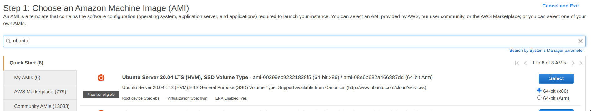
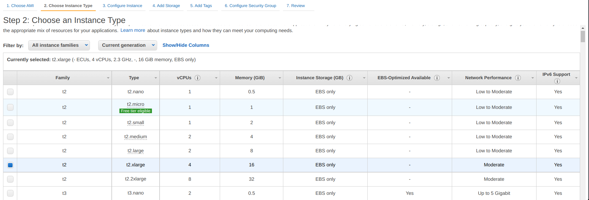
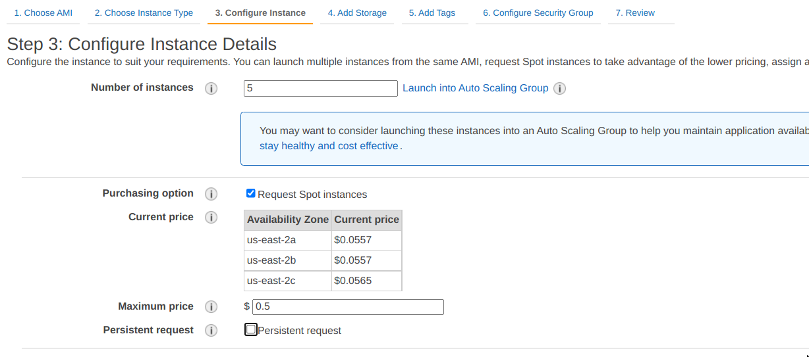
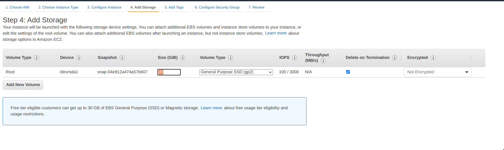
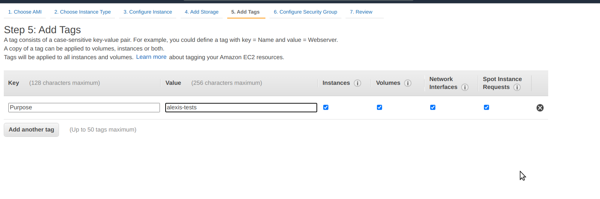
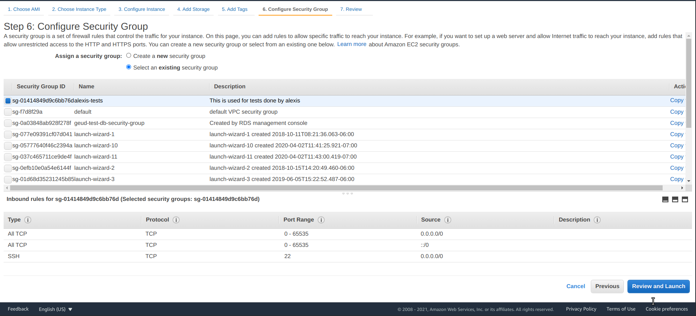
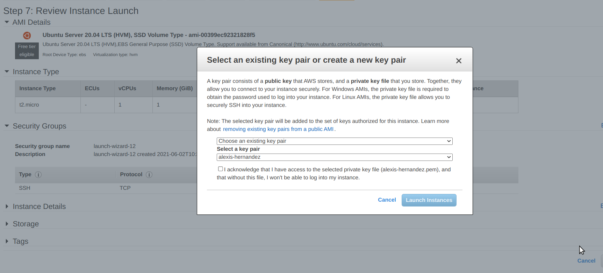
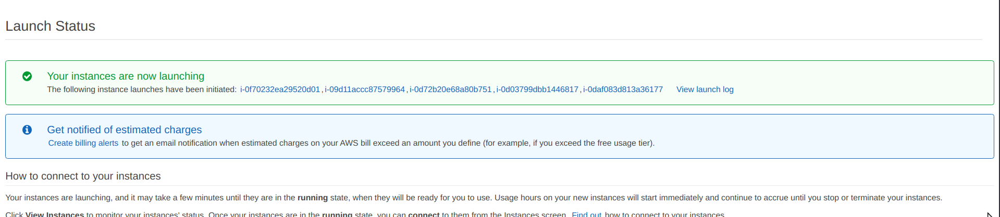
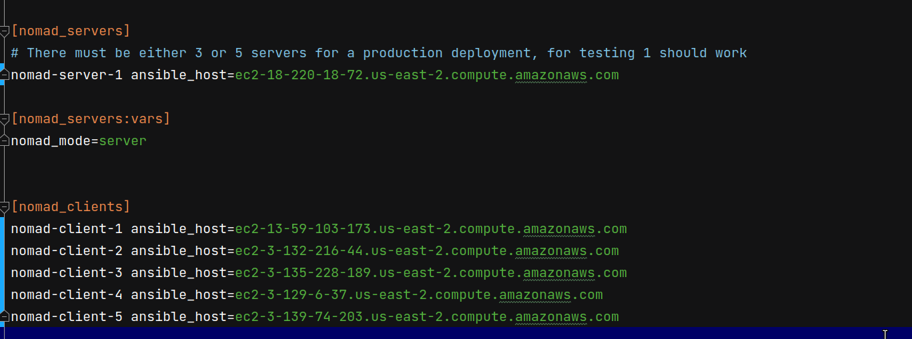

# On-premise deployments

**DISCLAIMER**: This is experimental work, use it at your own risk.

The goal is to be able to deploy PRISM to VMs without depending on any managed service.

## Pre-requisites
There are some pre-requisites before being able to deploy nomad.

### AWS settings
Grab your AWS keys and use them to create `config/aws/credentials`, it should look like (these keys should have access to pull containers from AWS ECR):

```ini
[default]
aws_access_key_id = [REPLACE_ME]
aws_secret_access_key = [REPLACE_ME]
```

---
**NOTE**

For Local Environment setup with Vagrant go to:
[Local deployments](VAGRANT.md)

---

### VM instances
While the approach is agnostic to any virtual machine, it has been tested with Ubuntu 20.04, having this, you should be able to use any cloud that provides virtual machines, or any physical instances.

This guide will illustrate how to launch a new cluster in AWS, once you complete the guide, you should have a nomad cluster deployed, and a prism environment ready.

### AWS
Follow these steps to create EC2 instances which are used to deploy the server, log into the AWS console, navigate to the EC2 instances, and choose the button to create new instances.

#### Choose operating system
Take `Ubuntu 20.04 (64-bit x86)`:



It is likely that any other Ubuntu or Debian based OS works but this is the OS where the scripts were tested.


#### Instance size

Choose the instance size, the minimum recommended requirements are 4 vCPU and 16 GiB RAM (t2.x.large), for production, we'll likely need higher capacity:




#### Instance details
Set the instance details:
- Number of instances: This is how many VMs you want to create, you should use at least 4, because 3 are required for the nomad cluster, and the rest would be used for the nomad clients, so, anywhere between 4 and 50 should do the trick.
- Request spot instances: This prevents to leave the instances running forever and is a cheaper way to test.
- Maximum price: 5x the current price should work to leave the instances running for several days, lower prices means that the instances will get terminated sooner.
  



#### Storage
Choose the storage, overall, something as small as 10 GiB should work for testing purposes:



#### Tags
It is ideal to tag your instances in case you ever need to find or identify those later:



#### Security group
What matters in the security group is that the necessary ports are opened, and connections can be accepted from the internet, for testing, it is enough to accept all connections in all ports, for production, this is obviously a bad idea, either choose the `alexis-tests` security group that has those characteristics or create a new one:



#### Ssh key selection
Make sure to select an ssh key that you have access to, or create a new one, this is important because it is the way how the scripts will connect to the VMs:



#### Launch status
Check out the launch status, and open each id to get the public ipv4 address, or the public dns to access your instance:



#### VM status
From each instance status, you can take the `Public IPv4 DNS` which is required for the next step:


#### Inventory file
First, clone `test-hosts.ini` to another file like `my-hosts.ini`: `cp test-hosts.ini my-hosts.ini`

Take the DNS from the instances you created and use those to add the nomad servers and the nomad clients, remember, 3 instances are required for the servers, all the rest are clients, your fill will look like this (just use 3 servers instead of 1):




## Deploy steps

Now that you have the requisites complete, it is the time to deploy the environment, note that this is tested with Ansible `2.9.21` (newest versions might work).

Run: `ansible-playbook -i my-hosts.ini consul.yml nomad.yml`

Take any DNS/IPv4 from the `[nomad_servers]` list and open it in a browser at port `4646`, which displays the nomad cluster UI, like `http://ec2-18-191-149-244.us-east-2.compute.amazonaws.com:4646`, same way, consul UI is available at port `8500`, like `http://ec2-18-191-149-244.us-east-2.compute.amazonaws.com:8500`.

**NOTE**: Each server running nomad needs to run consul too, nomad servers run consul servers, nomad clients run consul clients, this is already handled by the playbooks.

Once nomad is ready:
- Paste the content from [prism.nomad](./jobs/prism.nomad) in the nomad UI to create a job, submit it and wait for it to complete.
- To find the prism node/connector try all the nomad client addresses listed at `my-hosts.ini` until you get a response from one of those, it is important to use the port `8080` for the node, and `8081` for the connector.

To test the connector and the node, go to the [prism-backend](../../) project, use these commands by replacing the host from one of the nomad clients until the call succeeds.

### Node
Run: `sbt "nodeClient/run get-build-info -h ec2-18-117-85-98.us-east-2.compute.amazonaws.com -p 8080"`

Expect a response like:

```
version: "ed54105bd9942071a3ccb68369262d6c4945d653"
scala_version: "2.13.3"
sbt_version: "1.4.2"
```


### Connector
Run: `sbt "connectorClient/run get-build-info -h ec2-18-117-85-98.us-east-2.compute.amazonaws.com -p 8081"`

Expect a response like:

```
version: "ed54105bd9942071a3ccb68369262d6c4945d653"
scala_version: "2.13.3"
sbt_version: "1.4.2"
node_version: "ed54105bd9942071a3ccb68369262d6c4945d653"
```


## Misc
- From the nomad job description, take the `job.task.service.name` as the service name.
- Run `dig @127.0.0.1 -p 8600 ${service_name}.service.dc1.consul. ANY` to resolve the ip for a specific service.
- `consul catalog services` lists the registered services.

## TLS and Gossip Encryption
For TLS configuration we are using local CA setup with [cfssl](https://github.com/cloudflare/cfssl) tool with configuration files in [certs](./certs/), but for production ideally Hashicorp Vault should be used. Ansible will create CA certificate with matching key and use CA certificate to issue client/server certificates for both Nomad and Consul.
- [Nomad mTLS](https://learn.hashicorp.com/tutorials/nomad/security-enable-tls?in=nomad/transport-security) - To enable tls and gossip encryption for Nomad we need to set `nomad_tls_enabled: true` and `nomad_gossip_encryption_enabled: true` in `nomad.yml` ansible playbook
- [Consul mTLS](https://learn.hashicorp.com/tutorials/consul/tls-encryption-secure) - To enable tls and gossip encryption for Consul we need to set `consul_tls_enabled: true` and `consul_gossip_encryption_enabled: true` in `consul.yml` ansible playbook
- [Nomad Consul Stanza mTLS](https://www.nomadproject.io/docs/configuration/consul) - Configures the Nomad agent's communication with Consul using mTLS
- [Consul Connect](https://www.nomadproject.io/docs/integrations/consul-connect) - provides service-to-service connection authorization and encryption using mutual Transport Layer Security (mTLS)

## Missing
The integration is still not ready for a production deployment, there is a lot of stuff that needs to be secured, like:
- TLS - Make howto's import certificates into browser and use cli with tls.
- Secrets
- Authentication in nomad/consul
