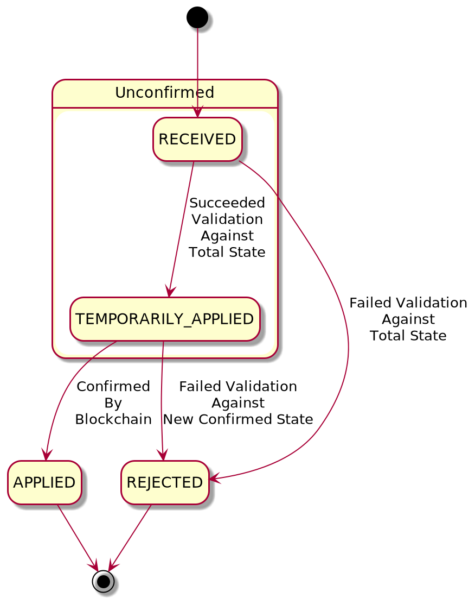

# PRISM while Cardano is offline
**WARNING: What is described in this document will not be implemented, and it is kept for historical records in case we want to revisit full offline mode capabilities again in the future**

This analyzes the different approach to keep PRISM working when Cardano is isolated from the rest of the world.

## Definitions
- **PRISM Node**: An application that follows the Slayer protocol. It sends transactions with metadata to the Cardano blockchain, read transactions confirmed by Cardano nodes, and interprets the relevant information from metadata in compliance with protocol rules.
- **Atala operation**: Metadata attached to a Cardano transaction, it is used to codify protocol events like Create DID, Issue Credential, etc. Look into the Slayer protocol documentation for more details.
- **Valid Atala operation**: An Atala operation that does not have any conflicts with the current state of PRISM Node.
- **Atala transaction**: A Cardano transaction with a list of Atala operations in its metadata.
- **Cardano confirmation**: A process in which Cardano network verifies the Cardano transaction using a proof-of-stake consensus mechanism.
- **Confirmed Cardano transaction**: A transaction that has received a sufficient number of Cardano confirmations (defined externally, usually 6).
- **Confirmed Atala transaction**: An Atala transaction that is a confirmed Cardano transaction.
- **Confirmed Atala operation**: An Atala operation that is a part of any confirmed Atala transaction.
- **Unconfirmed Atala operation**: An Atala operation that is not a part of any confirmed Atala transaction.

We will also use Atala operation and Atala object interchangeably in this document even though, technically speaking, Atala object can contain several operations. The notion of Atala objects is more useful while talking about the internal PRISM Node's design, while the notion of Atala operation is more useful from the end-user's perspective.

## Background
In the MoE deployment, the government can take the internet down for several weeks, when this happens, services running by the government can still communicate to each other, but, no service can communicate to the outside world.

As all the PRISM services will be run by the government, it means that PRISM services can still communicate with each other (let it be connector/console/node/cardano/etc), which allows people to keep using the system for most operations, including the interactions with the node. Of course, no new transactions will be pushed to Cardano neither we'll get new operations from Cardano, this is because our Cardano instance is now disconnected from other Cardano nodes.

The PRISM Node depends on the Cardano network to push changes to it (creating a DID, publishing credentials, etc), as well as to pull such changes from it once new Cardano transactions get confirmed.

The goal is that PRISM still works when Cardano is disconnected, from now, let's call it the `offline mode`, which mostly affects the PRISM Node because that's the only component interacting with Cardano. From now, everything will relate to the PRISM Node.

## Offline mode

### Current state
The Offline mode works in this way:
- Publishing anything that interacts with Cardano leaves the transaction in the Cardano mempool indefinitely, which is likely going to fail (we haven't tested nor prepared for it).
- Credentials/DIDs that are created/updated in confirmed Atala transactions can be resolved.
- A credential can be verified as long as the relevant data is in confirmed Atala objects.
- Atala operations are only validated once they have been confirmed by Cardano.
- Cardano is used a logical clock for sorting Atala operations (i.e. there is a happened-before relation between any two Atala operations).

### Goal
We expect PRISM to be fully functional in offline mode, even if we pull new confirmed Atala transactions later when PRISM gets online.

#### Publishing data
- Since we cannot use Cardano as a logic clock while in offline mode, an order for unconfirmed Atala operations will have to be defined.
- A new unconfirmed Atala operation needs to be validated both in respect of the confirmed Atala operations and the unconfirmed Atala operations that were published before it.
- Unconfirmed Atala operations should be persistent and be able to survive system restart.
- An unconfirmed Atala operation that was successfully validated (and hence potentially used by end-users) while PRISM Node was in offline mode is **not** guaranteed to be valid after PRISM Node goes back online. However, everything feasible from the PRISM Node's perspective should be done to confirm all unconfirmed Atala operations.

#### Resolving Credentials/DIDs
- Resolving data should have access to both: operations that have been confirmed by Cardano, and operations published during offline mode.
- Resolving data should indicate whether the relevant operations have been confirmed by Cardano or not.

#### Verifying a credential
Let's define the new verification process in terms of the existing verification (e-verification/e-verified) process. A credential should be reported as:
- **Verified** if
    * it can be e-verified by using exclusively confirmed Atala operations
    * it can be e-verified by using the union of confirmed and unconfirmed Atala operations
- **Revoked** if
    * it is considered revoked according to the e-verification process on exclusively confirmed Atala operations
    * it is considered revoked according to the e-verification process on the union of confirmed and unconfirmed Atala operations
- **Temporarily revoked** if:
    * it can be e-verified by using exclusively confirmed Atala operations
    * it is considered revoked according to the e-verification process on the union of confirmed and unconfirmed Atala operations
- **Temporarily verified** if:
    * it does not exist according to the e-verification process on exclusively confirmed Atala operations
    * it can be e-verified by using the union of confirmed and unconfirmed Atala operations
- **Nonexistent** otherwise

The potential unreliability of temporary states must be clearly relayed to the end-users.

*Proposal*: We could define a threshold to consider rejecting any unconfirmed Atala operations that are too far away from the last point of synchronization with Cardano. For example, verifying a credential that was just issued via an unconfirmed Atala operation could succeed (with a warning), while verifying a credential that has been issued a month ago could fail.


## Proposal
Update `node` to support the offline mode, by keeping two states (state include a list of created DIDs, a list of issued credentials etc):
- **Confirmed state** that holds PRISM Node's state as defined by an ordered list of confirmed Atala objects.
- **Unconfirmed state** that holds PRISM Node's state as defined by an ordered list of unconfirmed Atala objects.

Let's also define **total state** as a union of both confirmed and unconfirmed state.

Each unconfirmed Atala object has `atala_object_id` that distinguishes it and a status associated with it:
  * `UNKNOWN` for objects that do not exist.
  * `RECEIVED` for objects that have just been received, and they are not reflected in either of the states.
  * `REJECTED` for objects that are incompatible with the total state.
  * `TEMPORARILY_APPLIED` for objects that are now a part of unconfirmed state.
  * `APPLIED` for objects that have been confirmed and now a part of confirmed state.

The diagram below shows the status flow (validation and total state will be defined later in the document):


### PRISM Node API
Right now, any API that publishes data to Cardano follows this path:
1. The request is received, and then, stored in the `atala_objects` table.
2. The Atala object gets published to Cardano, the submission details are stored in the `atala_object_tx_submissions` table.
3. A transaction id is returned to the client invoking the request.

Remarks:
1. The state is not updated until the Cardano transaction gets confirmed.
2. Once the Cardano transaction is confirmed, the state is updated by applying the Atala Objects found in the transaction.
3. The returned transaction id **is not final**, if the transaction gets retried, the transaction id changes, leaving the client with a non-existent transaction id.
4. Every confirmed Atala Object gets processed sequentially, preventing race conditions.

Taking the unconfirmed state into consideration, the proposed path becomes:
1. The request is received, and then, stored in the `atala_objects` table.
2. The Atala Object **does not get** published to Cardano (changed).
3. The client gets back the `atala_object_id`, which is used to monitor the object state.
4. The Atala Objects Background Processor (defined later) will process the Atala object asynchronously, updating PRISM Node's state accordingly.
5. The Atala Objects Transaction Publisher (defined later) eventually (regardless of whether we have internet connectivity at the moment of receiving the request) publishes the Atala object to Cardano ledger.

Remarks:
1. The flow's complexity is delegated to the new Atala Objects Background Processor, which is defined later.

#### gRPC API for Publishing Atala Operations
Let us examine how gRPC API is going to change according to this proposal. We will take `CreateDID` RPC as an example. This is what its definition looks like right now:

```proto
service NodeService {
    rpc CreateDID(CreateDIDRequest) returns (CreateDIDResponse) {}
}

message CreateDIDRequest {
    SignedAtalaOperation signed_operation = 1; // The signed operation.
}

message CreateDIDResponse {
    string did = 1; // DID suffix
    TransactionInfo transaction_info = 2; // The on-chain transaction info where the DID is going to be created.
}
```

The RPC itself and the request definitions will be left the same, but, since we need to make transaction-related information non-mandatory in the API, the response will be changed to look like this:

```proto
message CreateDIDResponse {
    string did = 1; // DID suffix
    string operation_id = 2; // Operation id that identifies the published operation and can be used to track the operation status
}
```

All other RPCs that publish new Atala operations (`UpdateDID`, `IssueCredentialBatch`, `RevokeCredentials`) will be changed analogously.

#### gRPC API for Tracking Operation Status
This is what is being used to track transaction statuses right now:

```proto
service NodeService {
  rpc GetTransactionStatus(GetTransactionStatusRequest) returns (GetTransactionStatusResponse) {}
}
```

As was mentioned before, we try to no longer expose transactions in the API if inapplicable, so this RPC will be replaced with the following one:

```proto
service NodeService {
  rpc GetOperationState(GetOperationStateRequest) returns (GetOperationStateResponse) {}
}

message GetOperationStateRequest {
  string operation_id = 1; // Operation id that was returned on operation submission
}

message GetOperationStateResponse {
  OperationState state = 1;
}

message OperationState {
  oneof result {
    UnknownOperationState unknown_operation_state = 1; // The operation is not a known PRISM Node operation.
    ReceivedOperationState received_operation_state = 2; // The operation has been accepted by PRISM Node, but has not been processed yet.
    RejectedOperationState rejected_operation_state = 3; // The operation has been processed by PRISM Node, but deemed to be invalid.
    TemporarilyAppliedOperationState temporarily_applied_operation_state = 4; // The operation has been processed by PRISM Node, but has not been confirmed by the blockchain yet.
    AppliedOperationState applied_operation_state = 5; // The operation has been confirmed by PRISM Node and the underlying blockchain; the operation is now considered immutable.
  }
}

message UnknownOperationState {}
message ReceivedOperationState {
  google.protobuf.Timestamp received_at = 1;
}
message RejectedOperationState {
  google.protobuf.Timestamp rejected_at = 1;
  string reason = 2;
}
message TemporarilyAppliedOperationState {
  google.protobuf.Timestamp temporarily_applied_at = 1;
}
message AppliedOperationState {
  google.protobuf.Timestamp applied_at = 1;
  TransactionInfo transaction_info = 2;
}
```

#### gRPC API for Fetching State Information
Currently `LedgerData` is used to represent the state responses:
```proto
message LedgerData {
    string transaction_id = 1; // ID of the transaction.
    Ledger ledger = 2; // Ledger the transaction was published to.
    TimestampInfo timestamp_info = 3; // The timestamp of the protocol event.
}
```

We will replace it with `OperationData`:
```proto
message OperationData {
    string operation_id = 1; // ID of the operation.
    OperationState state = 2; // Operation state.
}
```

### Atala Objects Background Processor
Background Processor is a background job that processes incoming Atala objects and applies them to one of the relevant states (unconfirmed or confirmed) making sure that the states remain valid after the application.  While this new service reduces the overall complexity from the other layers, this won't be trivial to implement.

We will have two sets of tables:
1. **Confirmed tables** `did_data_confirmed`, `public_key_confirmed`, `credential_batches_confirmed` and `revoked_credentials_confirmed` for representing confirmed state.
2. **Unconfirmed tables** `did_data_unconfirmed`, `public_key_unconfirmed`, `credential_batches_unconfirmed` and `revoked_credentials_unconfirmed` for representing unconfirmed state.

Practically, identical tables from both states can be parts of a common table (e.g. `did_data` with a boolean `verified` field). The developer would then need to be careful with what to pick for primary key as, for example, two DIDs with the same suffix can be present in `did_data`: one representing confirmed DID and one representing a modified unconfirmed DID. In this proposal, however, we want to highlight that nothing will be removed from the confirmed state tables while unconfirmed state tables are transient and will treat these table sets as different entities.

Let's define **total tables** as the pair-wise union of the confirmed and unconfirmed tables (e.g. `did_data_confirmed` and `did_data_unconfirmed`) where conflicts are resolved in favor of the unconfirmed table (e.g. an unconfirmed DID overwrites the old confirmed entry for the same DID).

Background processor will have a stream process that takes data from two sources:
1. Confirmed Atala operations pulled from Cardano. For each confirmed Cardano transaction, we first check its compatibility with the data in confirmed tables. If it is compatible, we apply the transaction by inserting into/updating confirmed tables. Finally, we wipe the unconfirmed tables clean and try to reconstruct the unconfirmed state from scratch (the unconfirmed Atala object are still in the database). This will, however, be very slow, and we propose to follow this only as the very first iteration. Later, we can improve the process dramatically by checking all rows in unconfirmed tables on conflicts with the new confirmed operation (conflict detection and resolution will be defined later in the document) instead of trying to reconstruct the unconfirmed state.
2. Unconfirmed Atala operations pulled from the new rows in the `atala_objects` table. Those will be checked on compatibility with the total tables and applied to the unconfirmed tables if compatible.

All operations will be processed sequentially as it is important to not have any race conditions in the background processor. Priority of Atala objects for processing is defined in the following order:
1. Firstly, confirmed Atala operations pulled from Cardano sorted by the pair (block number, index of transaction inside the containing block) in ascending order.
2. Secondly, unconfirmed Atala operations sorted by insertion time into the database.

It is worth remarking that this process **does not** handle rollbacks from Cardano (yet).

Total state can be used to respond to the user requests.

#### Conflict resolution (Stage 2)
As mentioned in the previous section, there is a more efficient approach to recalculating the unconfirmed state. Let's say we have a confirmed state `S1` and an unconfirmed state `S1'` on top of it. We observe a new operation `T` affecting `S1` which results into a new confirmed state `S2`. Our thesis is that it is possible to express `S2'`, the new unconfirmed state, in terms of `S1'` with some transactions (or their reversals) applied. See Marcin's formalization document to gain more formal insight.

An operation from the unconfirmed state is not necessarily compatible with the confirmed state (after it got updated with new confirmed blocks). The following compatibility table provides information on whether two operations (one confirmed and one unconfirmed) on the same subject/with the same content are compatible:

| Confirmed \ Unconfirmed | Create DID     | Update DID    | Issue Cred Batch | Revoke Creds   |
| ----------------------- | -------------- | ----------    | ---------------- | -------------- |
| Create DID              | Replaced       | Compatible    | Compatible       | Compatible     |
| Update DID              | Replaced (N/A) | Incompatible* | Depends**        | Depends**      |
| Issue Cred Batch        | Replaced (N/A) | Compatible    | Replaced         | Compatible     |
| Revoke Creds            | Replaced (N/A) | Compatible    | Replaced (N/A)   | Incompatible*  |

- **N/A** means this combination cannot be on the same subject (and hence is compatible)
- **Replaced** means that the unconfirmed Atala object should be rejected and the operation removed from the unconfirmed state. The author of the object should be notified that his operation failed, but there is nothing to worry about and there is an identical operation already published by someone else.
- **Replaced (N/A)** means that this combination should not happen normally since the unconfirmed Atala object would have been replaced by some other confirmed Atala object before current one
- **Compatible** means that the unconfirmed Atala object should be kept as temporary applied, and the operation should be applied to the unconfirmed state. We will try to publish it once we finish catching-up with Cardano.
- **Incompatible** means that the unconfirmed Atala object can no longer be applied on top of the confirmed state. This is a serious issue, and we must notify the author of Atala object and propose a solution for him/her. For example, if we have pulled a new `UpdateDID` operation from Cardano, then the unconfirmed `UpdateDID` must use that new operation's hash as the last referenced operation. Hence, a notification should pop-up that says "hey, we have fixed this operation for you, review and sign if you are still happy with the transaction". This can potentially lead to a complicated chain of incompatible transactions and needs way more elaboration (should we leave this out for now?), moreover if an element of the chain ignores the notification and does not resign the operation, the remainder of the chain will remain invalid forever.
- **Depends** means that a deeper inspection into the operation is required to get one the other statuses

\* Since `UpdateDID` and `RevokeCredentials` require specifying the last seen operation, they can no longer be applied in their submitted form. The author will need to sign a new operation that specifies the most recent operation on this DID/batch from Cardano ledger as the last operation.

\*\* If the key used for issuance/revocation in the unconfirmed operation is also the one that is being revoked in the confirmed `UpdateDID`, then the operations are incompatible, otherwise they are compatible.

TODO:
1. We need an algorithm on how to propose fixes for incompatible conflicts.
2. How to notify an issuer of the conflict and relay the proposed fix to them? We can probably use connector's capability to relay e2e messages and devise a special message type that would carry the proposed fix to the user's wallet.
3. If the issuer ignores our notification, we need to be able to notify a higher-level entity in the MoE hierarchy. Some kind of hierarchical notification system must be designed to come with this proposal.

### Atala Objects Transaction Publisher
This is a background job that continuously monitors temporarily applied Atala objects and publishes them as Cardano transactions.

While in online mode, Transaction Publisher will publish transactions one-by-one. In other words, Transaction Publisher will wait until its last submitted transaction got confirmed before submitting a new one. We will call such last submitted unconfirmed transaction a **blocking transaction**. While this might seem slow, it is actually necessary in order to keep the order in which the objects where submitted by the users. Consider a transaction `Y` that depends on a transaction `X`. Then `X` gets posted first then `Y` second. Later, for some reason, `X` fails while `Y` gets confirmed. Resubmitting `X` could succeed, but `Y` could be now invalid because it could depend on the state from `X`.

Upon entering offline mode, Transaction Publisher will cancel the blocking transaction (via [Cardano forget transaction API](https://input-output-hk.github.io/cardano-wallet/api/edge/#operation/deleteTransaction)) and will be idle until we exit offline mode and catch up with Cardano.

The general description above leaves three questions unanswered:
1. How to detect when whether we entered the offline mode?
2. How to detect when we exited the offline mode?
3. How to detect when we caught up with Cardano?

For the first question, we propose to use a well-known external third party service and ping it every minute. Once we get 3 confirmations that the external service is unreachable, we assume that we entered offline mode. We propose to use Google DNS (8.8.8.8) as the external service of our choice.

The answer to the second question is symmetrical to the first one: we ping the external service in increasing time intervals (5s/15s/1m/5m/30m) until we can successfully reach it. Once we do so, PRISM Node is considered to be out of offline mode.

Finally, to answer the third question we need to monitor the latest block reported by Cardano Wallet and monitor the latest processed operation by Background Processor (reflect in `atala_objects` table). Once they get reasonably close together, we can declare that PRISM Node is caught up with Cardano again.

#### Batching (Stage 2)
Transaction Publisher can batch several consecutive operations together in order to save some ADA. The question of how long Transaction Publisher should wait for the potential batch to form and what cost implications it will entail are up to analysis.


### Infrastructure
The deployment is expected to run a single database for the Node, with 1 or many Nodes connecting to it (as long as many nodes updating the database doesn't cause conflicts).


## Alternatives

### New service between clients and node
Internally we have discussed adding a new micro-service on top of the Node, a centralized service that posts updates to Cardano. Such service handles all the operations by querying its local database.

The reasons to prefer updating Node instead of adding a new service are:
- The new micro-service will likely implement the same interface than the Node, it has to understand the Slayer 2 protocol, and, it needs to be aware of Cardano, adding a new service means that we'd have two services handling mostly the same stuff. The Offline mode could be a setting to enable it only when we need to.
- Adding a new service can hide the Node dependency requirement because PRISM will work normally even without it, the team maintaining the infrastructure could easily forget to get the Node back working because it might seem unnecessary.
- This would deviate the PRISM deployments because some of those will require the Offline mode while others may not, with a new service, any application involved should be aware of this, deploying different mobile apps just to enable this can be tricky.

### New service between node and Cardano
We have also discussed adding a micro-service in-between of `node` and Cardano. The idea is to make use of current `node`'s abstractions and move everything related to Cardano ledger to this service. Such service would have a notion of transaction being pre-published. `node` would see both published and pre-published transactions. In case of losing connectivity, such component would store pending transactions and attempt to publish them when connectivity is recovered.

The reasons to prefer updating Node instead of adding a new service are:
- The `node` would still have to know about the difference between confirmed and unconfirmed transactions. So a certain amount of code duplication will be necessary.
- The current abstraction will not be very useful as it presumes the immutability of the ledger. This is not the case with unconfirmed state.
- All data will be duplicated both on `node` and on such service.

### Client-side queues
We also discussed keeping the pending operations in the clients, retrying until Cardano is available.

The main reason to not follow this approach is because this won't meet the MoE goals, which is keeping PRISM working regardless of Cardano's connectivity.

### Allow Cardano to connect with the outside world
Carlos already proposed this but the government won't allow it.

## Conclusion
We propose to implement offline mode in three stages:
- **Stage 1**.
  - Introduce the breaking changes into gRPC API.
  - Implement Atala Objects Background Processor with naive unconfirmed state reconstruction.
  - Implement Atala Objects Transaction Publisher without batching. (TODO: there are still many details missing on how other parts of the publisher are supposed to work such as the offline mode detection)
- **Stage 2**.
  - Design/implement conflict detection process for the Background Processor.
  - Implement batching for Atala Objects Transaction Publisher.
- **Stage 3** (will be designed in a separate document).
  - Design/implement conflict resolution process for the Background Processor.
  - Design/implement a user notification system for conflict resolution proposals.
  - Design/implement a hierarchical notification system for notifying higher-level MoE entities in an event of the original issuer ignoring the notification.
